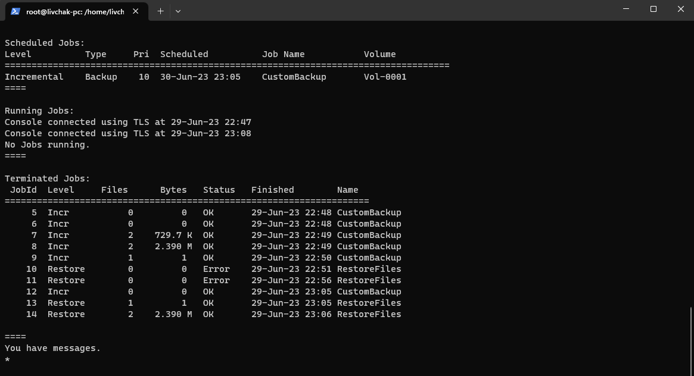
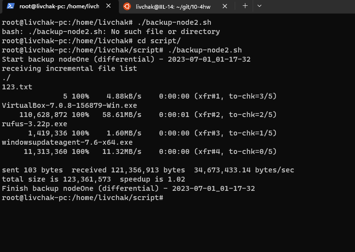

# Домашнее задание к занятию "`10-04hw`" - `Ливчак Сергей`

---

### Задание 1

`Разница между видами резервных копий`

1. Полное резервное копирование - способ при котором мы делаем копию всех данных. Такой способ очень затратный. Он даёт нагрузку на всю ситему - диски, сеть(если копирование по сети), уходит много времени на такие копии. По сути мы будем хранить при таком способе множество копий. Но это самый надежный способ копирования 
2. Диффиринциальное резервное копировние - Способ при котором мы делаем резервную копию вначале полную(опорную точку), а все последующие копии будут являться разницей между опорной точкой и текущим состоянием. из бонусов использования такого метода - время резервного копирования, объём копий до определённого момента. Слабые места - глубина резервных копий(в какой-то момент "изменённых данных может стать больше чем полного бекапа") и зависимость от утраты данных в опорной точке.
3. Инкрементное резервное копирование - этот способ сохраняет такие бонусы от диффиринциального как скорость резервирования, но при этом уменьшает избыточноть так как каждая следующая инкрементная копия хранит только разницу между прерыдущей такой копией и опорной точкой. Самый ненадежный способ резервного копирования так как целостность последней копии зависит от всех предыдущих и опорной точки. 

---

### Задание 2

`Установите программное обеспечении Bacula, настройте bacula-dir, bacula-sd, bacula-fd. Протестируйте работу сервисов.`

**Скриншот 2-1_1** 

Немного глубже копнул в Bacula, она мне понравилась больше чем rsync

[Bacula DIR](./configs/bacula-dir.conf)
[Bacula FD](./configs/bacula-fd.conf)
[Bacula SD](./configs/bacula-sd.conf)

---

### Задание 3

`Установите программное обеспечении Rsync. Настройте синхронизацию на двух нодах. Протестируйте работу сервиса.`

**Скриншот 3-1_1** 

[Rsync config](./configs/rsyncd.conf)
[Скрипт из лекции](./configs/backup-node1.sh)
[Скрипт поглубже](./configs/backup-node2.sh)

---

